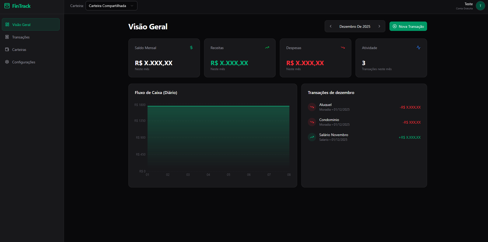
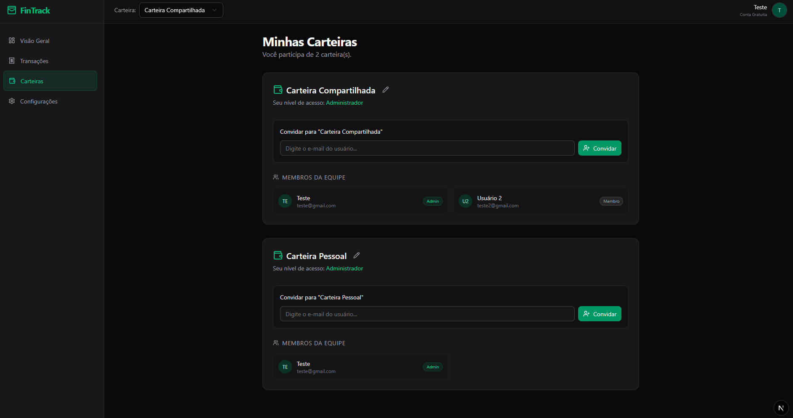

# 💰 FinTrack - Gerenciador Financeiro Pessoal

O **FinTrack** é uma aplicação web completa para gestão financeira, permitindo o controle de receitas e despesas com suporte a múltiplas carteiras (Multi-tenancy), gráficos interativos e compartilhamento de contas entre usuários.

| Visão Geral | Carteiras |
| :---: | :---: |
|  |  |

## 🚀 Funcionalidades

- **Dashboard Interativo:** Visão geral de saldo, receitas, despesas e fluxo de caixa mensal.
- **Gestão de Transações:** Adicione, edite e exclua receitas e despesas com categorização.
- **Multi-tenancy (Carteiras):**
  - Crie múltiplas carteiras (ex: Pessoal, Casa, Viagem).
  - Convide outros usuários para colaborar em uma carteira compartilhada.
- **Gráficos:** Acompanhamento visual da evolução do saldo dia a dia.
- **Responsivo:** Layout otimizado para Desktop e Mobile (com menu lateral adaptativo).
- **Segurança:** Autenticação robusta e proteção de dados com RLS (Row Level Security).

## 🛠️ Tecnologias Utilizadas

- **Frontend:** [Next.js 16](https://nextjs.org/) (App Router), React, TypeScript.
- **Estilização:** [Tailwind CSS](https://tailwindcss.com/) e [Shadcn UI](https://ui.shadcn.com/).
- **Backend & Banco de Dados:** [Supabase](https://supabase.com/) (PostgreSQL, Auth, Realtime).
- **Gráficos:** [Recharts](https://recharts.org/).
- **Deploy:** [Vercel](https://vercel.com/).

## 📦 Como Rodar o Projeto

### Pré-requisitos
- Node.js (v18 ou superior)
- Uma conta no Supabase

### Passo a Passo

1. **Clone o repositório:**
   ```bash
   git clone https://github.com/SEU_USUARIO/fintrack.git
   cd fintrack
   ```

2. **Instale as dependências:**
   ```bash
   npm install
   # ou
   yarn install
   ```

3. **Configure as Variáveis de Ambiente:**
   Crie um arquivo `.env.local` na raiz do projeto e adicione suas chaves do Supabase:
   ```env
   NEXT_PUBLIC_SUPABASE_URL=sua_url_do_supabase
   NEXT_PUBLIC_SUPABASE_ANON_KEY=sua_chave_anon_do_supabase
   ```

4. **Rode o servidor de desenvolvimento:**
   ```bash
   npm run dev
   ```

5. **Acesse o projeto:**
   Abra [http://localhost:3000](http://localhost:3000) no seu navegador.

## 🗄️ Estrutura do Banco de Dados (Supabase)

O projeto utiliza as seguintes tabelas principais:
- `profiles`: Dados públicos dos usuários.
- `workspaces`: Carteiras financeiras.
- `workspace_members`: Vínculo entre usuários e carteiras (com permissões).
- `transactions`: Lançamentos financeiros vinculados a um workspace.

## 🤝 Contribuição

Contribuições são bem-vindas! Sinta-se à vontade para abrir issues ou enviar pull requests.

---
Desenvolvido com 💚 por [Andre G. Bauzil](https://github.com/AndreBauzil)